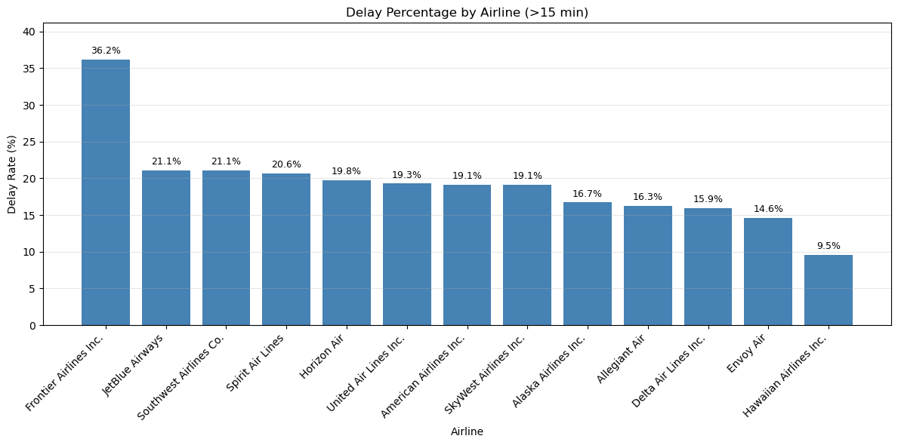
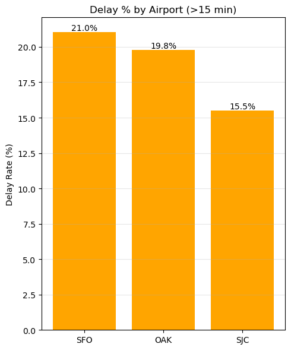
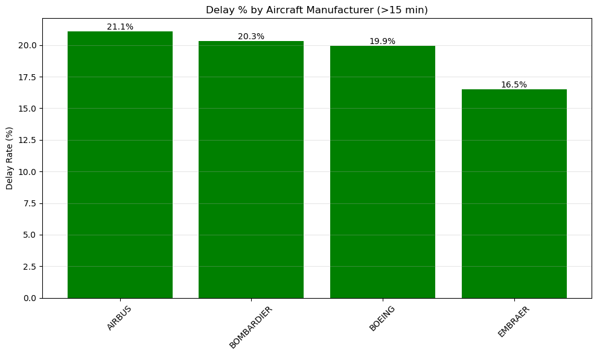
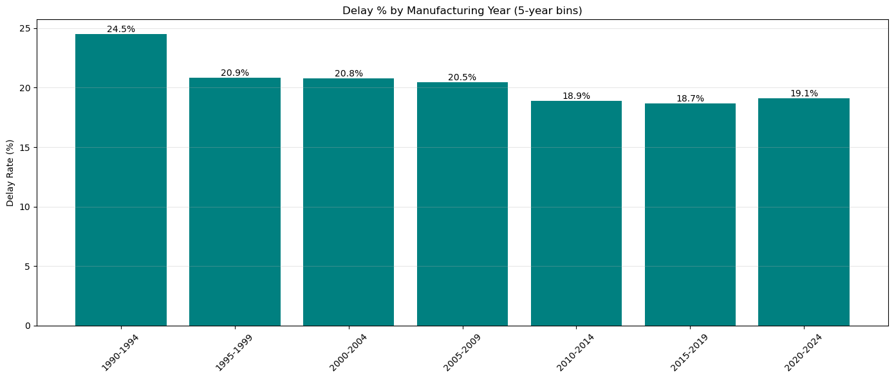
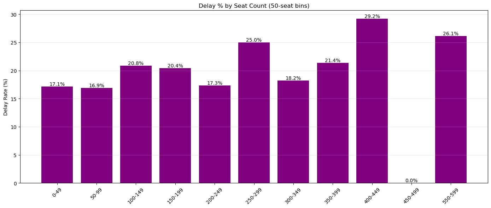
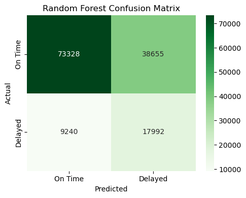
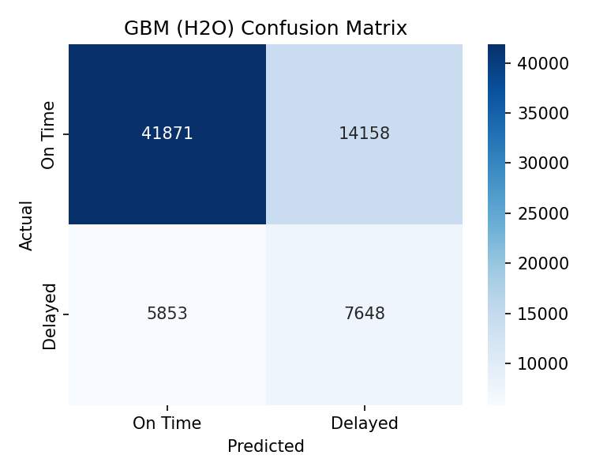
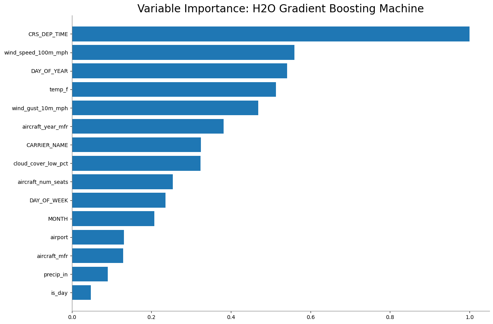

# Predicting Delays of Bay Area Flights

For my data science intro class, I built a binary classifier to predict whether a commercial flight departing from SFO, OAK, or SJC will be delayed by 15 or more minutes, combining BTS on-time performance data with Open-Meteo weather records and FAA aircraft registry data. The best Random Forest configuration achieved 66% recall on the held-out test set.

---

## Table of Contents

1. [Motivation](#motivation)
2. [Environment / Setup](#environment--setup)
3. [Algorithm / Approach](#algorithm--approach)
4. [Results](#results)
5. [Discussion](#discussion)
6. [Project Structure](#project-structure)
7. [Getting Started](#getting-started)
8. [Future Work](#future-work)

---

## Motivation

Travelling is fun, but delays can ruin an otherwise great trip. Airlines often know a delay is coming before passengers do, yet the notification arrives too late for anyone to act. I wanted to build a tool that could flag a flight as delay-prone before departure, using only information that is publicly available at booking time or shortly before.

The problem is harder than it looks. The strongest single-feature Pearson correlation with the binary delay label in my dataset is departure time of day, and that correlation is only around 0.15. Wind speed, gusts, and precipitation come in even lower. No single feature cleanly separates delayed from on-time flights, so the model has to aggregate many weak signals. On top of that, the dataset is class-imbalanced: most flights depart on time, which means a naive classifier can reach high accuracy by always predicting "on time" while being completely useless to a traveler.

I focused on departures rather than arrivals deliberately. Arrival delay is influenced by conditions at the destination airport and anything that happens en route, which are harder to know in advance. Departure delay is a more local problem, shaped by conditions at the origin airport, ground crew operations, and the state of the aircraft.

---

## Environment / Setup

The project covers commercial departures from three San Francisco Bay Area airports over two full calendar years.

| Parameter | Value |
|---|---|
| Airports | SFO (ID 14771), OAK (ID 13796), SJC (ID 14831) |
| Date range | January 2023 through December 2024 |
| Delay threshold | 15 minutes (departure delay) |
| Target type | Binary (1 = delayed, 0 = on time) |
| Train / test split | 70 / 30, stratified |

I chose Bay Area only to keep the dataset at a size my laptop could train on in reasonable time. Using full-year ranges (rather than going back to 2022 or earlier) avoids lingering post-pandemic distortions in traffic patterns.

### Datasets

Three sources were merged to build the final feature set.

**BTS Carrier On-Time Performance** is the backbone of the project. It lists every domestic U.S. commercial flight with carrier code, aircraft tail number, scheduled and actual departure times, and delay in minutes. I downloaded 24 monthly CSV files covering January 2023 through December 2024 and filtered to only Bay Area origin airports.

**Open-Meteo Historical Weather API** provided hourly weather readings for all three airports for the same date range. Weather matters because there are strict regulatory and operational limits on the conditions an aircraft can depart in. I used SFO as location 0, OAK as location 1, and SJC as location 2 in the weather CSV, and joined each flight row to the weather record matching its origin airport and scheduled departure hour.

**FAA Aircraft Registration Database** let me look up aircraft characteristics by tail number. Beyond reliability considerations, aircraft size affects what conditions a plane can operate in. I joined tail numbers from the BTS data to the FAA MASTER and ACFTREF tables, pulling manufacturer, model, number of seats, and year manufactured.

### Final Feature Set

| Column | Description |
|---|---|
| MONTH | Month of scheduled departure |
| DAY_OF_WEEK | 1 = Monday through 7 = Sunday |
| DAY_OF_YEAR | Day number within the calendar year |
| CRS_DEP_TIME | Scheduled departure time (HHMM integer) |
| temp_f | Temperature at departure airport (Fahrenheit) |
| cloud_cover_low_pct | Low-altitude cloud cover percentage |
| precip_in | Precipitation in inches |
| wind_speed_100m_mph | Wind speed at 100 m altitude (mph) |
| wind_gust_10m_mph | Wind gusts at 10 m (mph) |
| is_day | Binary: 1 if sun is up at departure time |
| aircraft_num_seats | Number of seats on the aircraft |
| aircraft_year_mfr | Year the aircraft was manufactured |
| airport | Origin airport code (OAK, SFO, SJC) |
| CARRIER_NAME | Airline name |
| aircraft_mfr | Aircraft manufacturer (AIRBUS, BOEING, BOMBARDIER, EMBRAER) |
| DELAYED | **Target:** 1 if departure delay >= 15 min |

I dropped year, tail number, aircraft model string, and raw delay minutes from the feature set. Year adds no signal across a two-year window. Tail number would be a high-cardinality identifier with no generalizable meaning. Aircraft model is captured adequately by manufacturer, seat count, and build year. Raw delay in minutes is the source of the target variable and cannot be used as a feature.

---

## Algorithm / Approach

### Data Pre-Processing

Getting all three sources aligned took the most time in the project. I will not pretend otherwise.

After filtering to Bay Area flights, I merged weather by matching each flight's origin location ID and scheduled departure hour (floored to the hour). Aircraft data was joined by tail number after normalizing the N-number prefix across both datasets.

A substantial fraction of rows had missing tail numbers or missing aircraft detail fields. I handled these with hierarchical imputation: first, I grouped by carrier, seat count, and build year to find the most common aircraft model within that narrow group; then I fell back to the most common model per carrier alone; and finally I used the global median for numeric fields. This reflects the real-world consistency of airline fleets: a carrier tends to operate a small set of aircraft types on a given route.

Manufacturer names required normalization because the FAA data uses inconsistent strings ("AIRBUS INDUSTRIE," "AIRBUS SAS," "AIRBUS CANADA LP," etc.). I mapped all variants to four canonical names: AIRBUS, BOEING, BOMBARDIER, and EMBRAER.

Rows with missing DEP_DELAY_NEW were dropped entirely. Since this is the source of the target variable, imputing it would mean inventing labels, which would corrupt the model.

Categorical columns (airport, CARRIER_NAME, aircraft_mfr) were one-hot encoded before model training.

### Model Selection

I chose a Random Forest for several reasons. Flight delay is not a linear problem. The clearest example is the day-of-year feature: I added it to capture seasonal travel peaks around holidays and summer, but that relationship is cyclical, not linear. Random forests handle nonlinear interactions without requiring feature engineering to make them linear. The existing literature on similar problems also reported better results from tree ensembles than from linear classifiers.

I deliberately avoided KNN because it struggles with high-cardinality categorical variables and because prediction at inference time scales poorly with dataset size.

Given the class imbalance (on-time flights outnumber delayed ones roughly 4:1), I used `class_weight="balanced"` during training. This upweights the minority class in the loss function so the model cannot simply learn to predict "on time" for everything. Recall was my primary optimization target. A tool that never flags a delay is useless to a traveler.

### Random Forest Hyperparameters

| Parameter | Value | Reason |
|---|---|---|
| n_estimators | 200 | Enough trees to stabilize variance without excessive runtime |
| max_depth | 12 | Limits overfitting while allowing complex interactions |
| class_weight | "balanced" | Compensates for the ~4:1 on-time to delayed ratio |
| bootstrap | True | Standard bagging for variance reduction |
| random_state | 789 | Reproducibility |
| test split random_state | 123 | Reproducibility |

### GBM Attempt

After reading Kiliç and Sallan (2023), I also attempted a Gradient Boosting Machine using H2O. GBMs build trees iteratively, with each tree correcting the residual error of the previous one. I used the hyperparameters from the paper as a starting point.

| Parameter | Value |
|---|---|
| ntrees | 500 (with early stopping) |
| max_depth | 17 |
| sample_rate | 0.91 |
| col_sample_rate | 0.33 |
| min_rows | 16 |
| nbins | 512 |
| distribution | bernoulli |
| balance_classes | True |
| stopping_metric | AUC |
| stopping_rounds | 5 |

The H2O GBM used a 70/15/15 train/validation/test split rather than the 70/30 used for the Random Forest.

---

## Results

### Data Analysis

Before modeling, the dataset reveals meaningful patterns in delay rates across airlines, airports, manufacturers, and aircraft characteristics.

**By airline:** Frontier had the highest delay rate at 36.2%, followed by JetBlue and Southwest at 21.1% each, Spirit at 20.6%, and Horizon Air at 19.8%. At the lower end, Delta had a 15.9% delay rate, Envoy 14.6%, and Hawaiian 9.5%. Budget carriers cluster at the top, which I attribute to their thinner operational margins and less buffer time between turns.



**By airport:** SFO had the highest delay rate at 21.0%, OAK at 19.8%, and SJC at 15.5%. SFO's crosswind limitations and frequent go-around operations make it particularly sensitive to wind conditions.



**By manufacturer:** AIRBUS at 21.1%, BOMBARDIER at 20.3%, BOEING at 19.9%, and EMBRAER at 16.5%. These differences are modest and likely reflect which airlines operate each type rather than inherent aircraft differences.



**By aircraft age:** Aircraft manufactured in 1990-1994 had a delay rate of 24.5%. The most recently manufactured cohort (2020-2024) showed 19.1%. The general trend confirms my hypothesis that older aircraft have higher delay rates, though whether this is due to mechanical reliability or fleet assignment practices is hard to separate.



**By seat count:** The relationship between seat count and delay rate is positive but non-monotonic. The 400-449 seat bin reached 29.2% delay rate. Larger aircraft serve busier routes and require more time for boarding, fueling, and baggage loading, making them more sensitive to schedule disruptions cascading through the day.



### Model Performance

**Random Forest (test set, 70/30 split):**

```
Confusion Matrix:
              Predicted On Time    Predicted Delayed
Actual On Time        73328               38655
Actual Delayed         9240               17992

Accuracy:   ~65.6%
Recall:     ~66.1%   (17992 / 27232)
Precision:  ~31.8%   (17992 / 56647)
```



**GBM via H2O (test set, 70/15/15 split):**

```
Confusion Matrix (Act/Pred):
         0        1      Error
0    41871    14158    0.2527
1     5853     7648    0.4335
Total 47724   21806    0.2878

Accuracy:   ~71.2%
Recall:     ~56.6%   (7648 / 13501)
```



The Random Forest achieved higher recall (66.1%) than the GBM (56.6%), though the GBM had higher overall accuracy (71.2% vs 65.6%). For the use case of flagging risky flights for travelers, recall is the metric that matters.

For comparison, the reference paper by Kiliç and Sallan (2023) achieved 88% recall using a similar approach but trained on arrival-based features including actual flight times and delay propagation from earlier flight segments.

### Feature Importances

Scheduled departure time (CRS_DEP_TIME) ranked as the top feature in both models. Wind-related features (wind_gust_10m_mph, wind_speed_100m_mph) appeared in the top tier but with lower importance. Airline carrier was also a meaningful contributor.



---

## Discussion

### What worked

The Random Forest handled the class imbalance problem better than I expected once I added `class_weight="balanced"`. Without it, the model collapsed to predicting "on time" for nearly everything and was worthless. The combination of one-hot encoding for categoricals and the balanced weighting gave the model enough signal to capture delays at a 66% recall rate, which is meaningfully better than random and better than a naive baseline.

The data analysis section worked well. The patterns in delay rates by airline, airport, aircraft age, and seat count are clear and interpretable. Some of these findings, like budget airlines having higher delay rates and SFO being more delay-prone than SJC, match what I would have predicted from domain knowledge. The aircraft size finding surprised me: I expected weather to dominate, but the positive correlation between seat count and delays suggests that operational complexity and schedule propagation matter more than meteorological limits.

### What did not work

The GBM performed worse on recall than the Random Forest despite being a more sophisticated algorithm. I used the reference paper's hyperparameters as a starting point, but those were tuned for an arrival-delay task with different features. I did not do enough independent hyperparameter search on the GBM for my specific problem, and the risk of overfitting with 500 deep trees on a dataset this size was real.

More fundamentally, the models are limited by what the features can actually tell them. The dominant sources of delay are operational and network-based: whether the inbound aircraft arrived late from a previous city, whether a crew timed out, whether a gate conflict pushed the departure. None of these variables are in the dataset. The reference paper that reached 88% recall had access to arrival-based features and delay propagation signals that encode exactly this kind of network state. My model only sees local airport conditions and static aircraft characteristics at the moment of departure.

The strongest Pearson correlation in my dataset is 0.15. That ceiling was always going to limit how well any model could do. I would do this project differently by starting with correlation analysis before committing to a target variable, to understand what signal is realistically available before investing in data collection and preprocessing.

### What I would do differently

The preprocessing was the most time-consuming part and the place where I made the most guesses about the right approach. I would spend more time upfront validating the weather join, making sure the time-zone alignment between BTS timestamps (which are local time) and Open-Meteo data is correct. A single-hour offset in the weather join could corrupt the feature values for a large fraction of rows.

I would also explore whether the raw delay distribution could support a multi-class target (e.g., on-time, minor delay 15-45 min, major delay 45+ min) rather than binary. The binary threshold at 15 minutes is standard, but it collapses a lot of variation in the "delayed" category that might be learnable.

---

## Project Structure

```
DelayProject/
├── DelayProject.ipynb              # Main analysis and modeling notebook
├── DelayProjectFinalReport.pdf     # Written final report
├── final_flight_dataset.csv        # Merged, cleaned dataset ready for modeling
├── carriers.csv                    # Lookup table: carrier code to airline name
├── DelayData/
│   ├── jan23.csv ... dec24.csv     # 24 monthly BTS on-time performance files
├── WeatherData/
│   └── weather.csv                 # Hourly weather for OAK, SFO, SJC (2023-2024)
└── AircraftRegistrationData/
    ├── MASTER.txt                  # FAA aircraft registry (tail number → model code)
    ├── ACFTREF.txt                 # FAA aircraft reference (model code → type details)
    ├── DEREG.txt                   # FAA deregistered aircraft
    └── ardata.pdf                  # FAA documentation for the registry files
```

**DelayProject.ipynb** is the single notebook that does everything: preprocessing all three datasets, merging them, exploratory data analysis, and training both the Random Forest and GBM models. The cells run sequentially from top to bottom.

**final_flight_dataset.csv** is the output of the preprocessing cells. If the raw data files are available, the notebook regenerates this file. If they are not, the CSV can be used directly to rerun the modeling cells.

**DelayData/** holds monthly downloads from the BTS Airline On-Time Performance database. Each file covers one month of all U.S. domestic departures; the notebook filters to Bay Area origins.

**WeatherData/weather.csv** was retrieved from the Open-Meteo Historical Weather API. It contains hourly readings for three location IDs (SFO=0, OAK=1, SJC=2) across the full 2023-2024 date range.

**AircraftRegistrationData/** contains the FAA's registry flat files. MASTER.txt maps tail numbers to manufacturer-model codes; ACFTREF.txt maps those codes to human-readable manufacturer names, model names, and seat counts.

---

## Getting Started

### Prerequisites

```bash
pip install pandas numpy scikit-learn matplotlib seaborn
# Optional, for the GBM cell only:
pip install h2o
```

### Running the notebook

Clone or download this repository, then open the notebook:

```bash
jupyter notebook DelayProject.ipynb
```

Run all cells in order. The first several cells build the merged dataset and write it to `final_flight_dataset.csv`. The modeling cells (starting at cell 25) load features from the in-memory dataframe.

If you want to skip the preprocessing and jump straight to the modeling, you can load the exported dataset:

```python
import pandas as pd
df = pd.read_csv("final_flight_dataset.csv")
```

Then run the Random Forest cell (cell 25) from that point forward.

### Data sources

The raw data files are not included in this repository due to file size. To reproduce the full pipeline from scratch:

- **BTS On-Time Performance:** Download monthly CSV files from the Bureau of Transportation Statistics Airline On-Time Performance dataset. Filter for years 2023 and 2024, place each file in `DelayData/` with names like `jan23.csv`.
- **Weather:** Use the Open-Meteo Historical Weather API to pull hourly data for the three airport coordinates across 2023-2024. Save to `WeatherData/weather.csv` with location IDs 0 (SFO), 1 (OAK), and 2 (SJC).
- **FAA Registry:** Download the MASTER and ACFTREF flat files from the FAA Aircraft Registry. Place them in `AircraftRegistrationData/`.

---

## Future Work

The most impactful improvement would be adding inbound-aircraft delay as a feature. Whether the plane arriving from its previous city was already late is probably the single strongest predictor of an outbound delay, and it is available in the BTS dataset by matching tail numbers across consecutive legs. Beyond that, a federal holiday calendar feature would sharpen the seasonal signal that DAY_OF_YEAR only approximates, and a proper hyperparameter search for the GBM (rather than borrowing parameters tuned for a different task) would likely close some of the gap between it and the Random Forest on recall.
